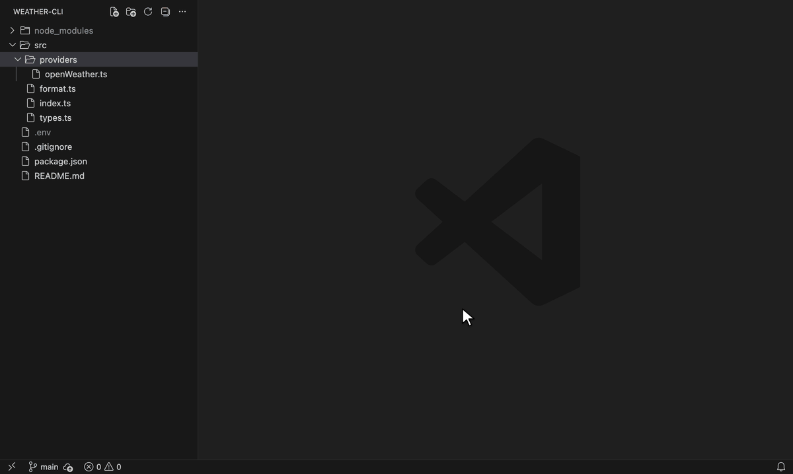
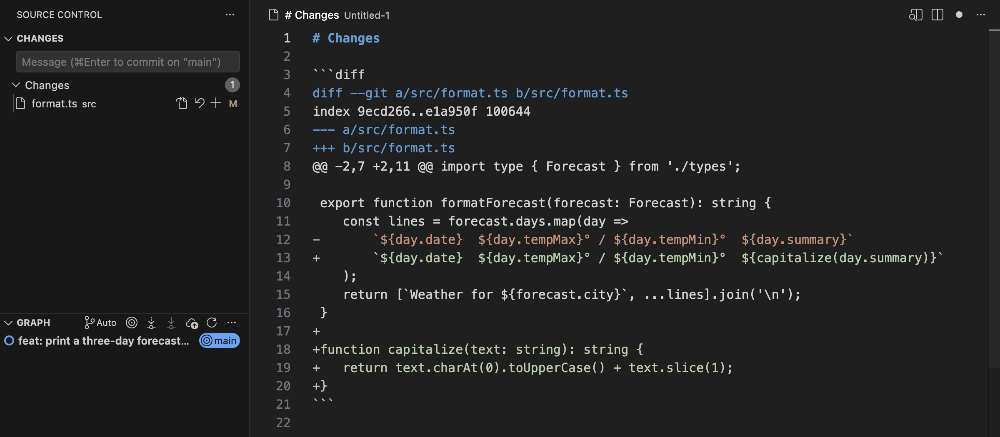

# Copy4AI

[](https://marketplace.visualstudio.com/items?itemName=LeonKohli.snapsource)
[](https://marketplace.visualstudio.com/items?itemName=LeonKohli.snapsource)
[](https://open-vsx.org/extension/LeonKohli/snapsource)
[](LICENSE)

Right-click files or folders in VS Code and copy their contents, with a project tree, as one block you can paste into ChatGPT, Claude, Gemini, or any other LLM.

Copy4AI leaves out what the model doesn't need. By default, dot files, `.gitignore` matches, and `node_modules` stay out, and binary files and files over 1 MB appear only as a one-line note. Everything else is copied exactly as it is on disk, comments and whitespace included.



## Install

Install [Copy4AI from the VS Code Marketplace](https://marketplace.visualstudio.com/items?itemName=LeonKohli.snapsource), or run this in the Quick Open box (<kbd>Ctrl</kbd>+<kbd>P</kbd>, or <kbd>Cmd</kbd>+<kbd>P</kbd> on macOS):

```text
ext install LeonKohli.snapsource
```

Cursor, Windsurf, VSCodium, and other editors that use Open VSX can install [Copy4AI from Open VSX](https://open-vsx.org/extension/LeonKohli/snapsource).

Copy4AI was called SnapSource before version 1.0.13. The extension ID is still `LeonKohli.snapsource`.

## Copy files for a prompt

1. Select one or more files or folders in the Explorer.
2. Right-click the selection and choose **Copy to Clipboard (Copy4AI)**.
3. Paste into your chat.

Copying the `src` folder of a small project gives you this:

````markdown
# Project Structure

```
src/
├── utils
│   └── math.ts
└── index.ts
```

# File Contents

## src/index.ts

```typescript
import { add } from './utils/math';

console.log(add(2, 3));
```

## src/utils/math.ts

```typescript
export const add = (a: number, b: number) => a + b;
```
````

File paths are relative to the workspace folder. If a file itself contains Markdown code fences, Copy4AI uses a longer fence around it so the output stays valid Markdown.

Set `copy4ai.outputFormat` to `xml` or `plaintext` if your prompt works better with those formats. Claude, for example, handles XML tags well.

<details>
<summary>The same copy as XML</summary>

```xml
<?xml version="1.0" encoding="UTF-8"?>
<copy4ai>
  <project_structure>
    src/
    ├── utils
    │   └── math.ts
    └── index.ts

  </project_structure>
  <file_contents>
    <file path="src/index.ts">
      <![CDATA[import { add } from './utils/math';

console.log(add(2, 3));]]>
    </file>
    <file path="src/utils/math.ts">
      <![CDATA[export const add = (a: number, b: number) => a + b;]]>
    </file>
  </file_contents>
</copy4ai>
```

</details>

<details>
<summary>The same copy as plain text</summary>

```text
Project Structure:

src/
├── utils
│   └── math.ts
└── index.ts


File Contents:

--- src/index.ts ---
import { add } from './utils/math';

console.log(add(2, 3));

--- src/utils/math.ts ---
export const add = (a: number, b: number) => a + b;
```

</details>

## Commands

| Command | Where to find it | What it copies |
|---|---|---|
| **Copy to Clipboard (Copy4AI)** | Explorer, editor, and editor tab context menus | The selected files and folders, with a project tree |
| **Copy Project Structure (Copy4AI)** | Explorer and editor context menus | Only the tree: the folder you right-clicked, or the whole workspace when you right-click a file |
| **Copy Source Control File Contents (Copy4AI)** | Source Control view, on changed files | The full contents of the selected changed files |
| **Copy Changes (Copy4AI)** | Source Control view, on changed files in Git repositories | A unified diff against `HEAD` for the selected files |
| **Copy4AI: Toggle Project Tree** | Command Palette | Nothing. Switches `copy4ai.includeProjectTree` in your user settings. |
| **Copy4AI: Toggle Dot Files Inclusion** | Command Palette | Nothing. Switches `copy4ai.ignoreDotFiles` in your user settings. |

Copy4AI has no default keyboard shortcuts. To add one, bind `snapsource.copyToClipboard` in **Keyboard Shortcuts**. The shortcut copies the selection in the focused Explorer or Source Control view, including a multi-selection. If nothing is selected, it copies the file in the active editor.

The editor tab entry is hidden while several tabs are selected, because VS Code does not pass a tab selection to extensions ([microsoft/vscode#213699](https://github.com/microsoft/vscode/issues/213699)). To hide **Copy Project Structure (Copy4AI)** from the context menus, set `copy4ai.showCopyProjectStructure` to `false`.

**Copy Source Control File Contents (Copy4AI)** skips deleted files and shows a warning that names them. If every selected file was deleted, the command fails and your clipboard stays unchanged.

## The project tree

The tree shows only what you copied: the selected files, everything inside the selected folders, and the parent folders that lead to them. Unrelated parts of the workspace stay out.

When you copy a single folder, the tree starts at that folder, as in the example above. When you copy several items or a single file, the tree starts at the workspace folder. **Copy Project Structure (Copy4AI)** shows the complete tree of the folder, not only a selection.

`copy4ai.maxDepth` limits how deep the tree goes. The default is 5 levels. The limit applies only to the tree. Copy4AI still copies the contents of deeper files. To copy file contents without the tree, run **Copy4AI: Toggle Project Tree** or set `copy4ai.includeProjectTree` to `false`.

## What stays out

Copy4AI skips these files completely, in both the tree and the contents:

- Files and folders whose names start with a dot, such as `.env`, `.git`, and `.github`. Set `copy4ai.ignoreDotFiles` to `false` to include them.
- Paths matched by the `.gitignore` in the workspace root. Nested `.gitignore` files are not read. Set `copy4ai.ignoreGitIgnore` to `false` to include these paths.
- Paths matched by `copy4ai.exclude`. The default excludes `node_modules` and `*.log`. See [Exclude files](#exclude-files).

Some files appear in the tree but their contents are replaced with a short note:

| File | Replaced with |
|---|---|
| Binary file | `[Binary file content not included]` |
| Larger than `copy4ai.maxFileSize` (1 MB by default) | `[File too large: 2.3 MB > 1.0 MB]` |
| Matched by `copy4ai.excludeContentPatterns` | `[File content not included]` |
| Not valid UTF-8, for example UTF-16 | A note that asks you to convert the file to UTF-8 |

One unreadable file never stops the copy. Copy4AI adds a note for that file and copies the rest.

Copy4AI does not scan file contents for secrets. `.env` files stay out because their names start with a dot, but an API key hard-coded in `config.ts` is copied like any other line. Check what you paste, and add files with secrets to `copy4ai.exclude`.

## Quiet by default

While Copy4AI collects your files, a spinner sits in the status bar. When it finishes, a check and a short line replace it for a few seconds. Copying is not a decision you have to make, so it does not interrupt you with a notification.

Warnings and errors still appear as notifications: skipped files, a failed copy, and the token limit warning with its **Configure Exclusions** button. To silence those too, open the gear menu on any Copy4AI notification and choose **Turn Off Info and Warning Notifications**. VS Code keeps sending errors.

## Your code stays on your machine

Copy4AI makes no network requests and collects no telemetry. It reads your files, writes the result to your clipboard, and counts tokens locally. Nothing goes to a model until you paste it.

## Copy only what changed

In the Source Control view, right-click changed files and choose **Copy Changes (Copy4AI)**. You get a unified diff against `HEAD` instead of full files, which costs far fewer tokens when the question is about the change.



Untracked files appear as new-file diffs with their full contents. The diff comes from the built-in Git extension and follows your Git config, so it matches what `git diff` prints in your terminal. The output uses `copy4ai.outputFormat`.

If none of the selected files has changes, the command fails and your clipboard stays unchanged.

## Count tokens before you paste

Set `copy4ai.enableTokenCounting` to `true` to see the token count of every copy in the status bar. The count runs offline.

Set `copy4ai.llmModel` to the model you paste into, for example `claude-opus-5`, `gpt-5.5`, or `gemini-3-pro`. The name selects the tokenizer, and dated names such as `claude-opus-5-20260416` work:

- OpenAI models (`gpt-*`, `o1`, `o3`, `o4`) get exact counts.
- Claude models (`claude-*`) use Anthropic's legacy tokenizer. Counts are about 1 to 2 percent off.
- Other models use a characters-divided-by-4 estimate.

Above `copy4ai.maxTokens`, Copy4AI shows a warning with a **Configure Exclusions** button. The default is 100,000 tokens, far below the context window of current models. Long-context evaluations show answers degrading well before the window is full, so the window is the wrong place to warn. Set the value that fits your budget, or `0` to turn the warning off.

## Exclude files

Use `copy4ai.exclude` in your user or workspace settings:

```json
"copy4ai.exclude": {
  "paths": ["src/config", "vendor/unwanted-package"],
  "patterns": ["node_modules", "*.log", "*.tmp", "build/"]
}
```

- `paths` excludes exact files or folders, and everything inside those folders. Write the paths relative to the workspace folder. Absolute paths also work for local files.
- `patterns` uses `.gitignore` syntax. `build/` matches only folders named `build`. `*.tmp` matches files at any depth.

VS Code merges your object with the default, so `{}` keeps `node_modules` and `*.log` excluded. To turn off every Copy4AI exclusion, set both lists to `[]`. Dot files and `.gitignore` matches still stay out until you change their own settings.

To keep a file in the tree but drop its contents, add a pattern to `copy4ai.excludeContentPatterns`, for example `["**/*.svg", "assets/**"]`.

Older setups use `copy4ai.excludePaths` and `copy4ai.excludePatterns`. Both are deprecated and no longer appear in the Settings editor unless you have set them. They still work when `copy4ai.exclude` is not set in your user or workspace settings. When it is set, `copy4ai.exclude` wins.

## Settings

| Setting | Default | Description |
|---|---|---|
| `copy4ai.outputFormat` | `"markdown"` | Output format: `markdown`, `xml`, or `plaintext`. |
| `copy4ai.includeProjectTree` | `true` | Add a project tree above the file contents. |
| `copy4ai.maxDepth` | `5` | Maximum depth of the project tree. |
| `copy4ai.showCopyProjectStructure` | `true` | Show **Copy Project Structure (Copy4AI)** in the Explorer and editor context menus. |
| `copy4ai.ignoreDotFiles` | `true` | Skip files and folders whose names start with a dot. |
| `copy4ai.ignoreGitIgnore` | `true` | Skip paths matched by the `.gitignore` in the workspace root. |
| `copy4ai.exclude` | `{ "paths": [], "patterns": ["node_modules", "*.log"] }` | Paths and `.gitignore`-style patterns to skip. |
| `copy4ai.excludeContentPatterns` | `[]` | Patterns for files that appear in the tree without their contents. |
| `copy4ai.maxFileSize` | `1048576` | Largest file, in bytes, whose contents are copied. |
| `copy4ai.enableTokenCounting` | `false` | Count tokens after each copy. |
| `copy4ai.llmModel` | `"claude-sonnet-5"` | Model that selects the tokenizer. |
| `copy4ai.maxTokens` | `100000` | Token count that triggers the warning. `0` turns it off. |
| `copy4ai.enableTokenWarning` | `true` | Deprecated. Set `copy4ai.maxTokens` to `0`. |
| `copy4ai.excludePaths` | `[]` | Deprecated. Use `copy4ai.exclude.paths`. |
| `copy4ai.excludePatterns` | `["node_modules", "*.log"]` | Deprecated. Use `copy4ai.exclude.patterns`. |

## Remote and untrusted workspaces

Copy4AI reads files through the VS Code file system API, so it works in Remote SSH, WSL, Dev Containers, Codespaces, and other virtual workspaces.

In Restricted Mode, the copy commands still work, but Copy4AI ignores Copy4AI settings from the workspace until you trust it. Your user settings still apply.

## Known limitations

- Only the `.gitignore` in the workspace root is read. Rules in nested `.gitignore` files don't apply.
- One copy can't mix files from different folders of a multi-root workspace.
- **Copy to Clipboard (Copy4AI)** is not in the context menu of a workspace root folder. Select the files and folders inside it instead, or use **Copy Project Structure (Copy4AI)** for the tree.
- To read the Explorer selection from a keyboard shortcut, Copy4AI briefly puts the selected file paths on the clipboard, then restores the previous clipboard content. A clipboard manager can record those paths.
- The editor tab entry is hidden while several tabs are selected. See [Commands](#commands).

## Requirements

VS Code 1.104 or later.

## Feedback

Report bugs and ask for features in [GitHub Issues](https://github.com/LeonKohli/copy4ai/issues/new/choose). The [changelog](CHANGELOG.md) lists every release.

## Development

You need [Bun](https://bun.sh) and Node.js 22 or later.

```bash
bun install
bun run compile   # build once, or `bun run watch` while you edit
bun run test      # compile, lint, and run the tests in a separate VS Code instance
```

Press <kbd>F5</kbd> in VS Code to start an Extension Development Host with your build.

## License

Copyright (C) 2024-2026 Leon Kohli. Copy4AI is licensed under the [GNU General Public License v3.0](LICENSE). Versions up to 2.0.0 were released under the MIT License.
